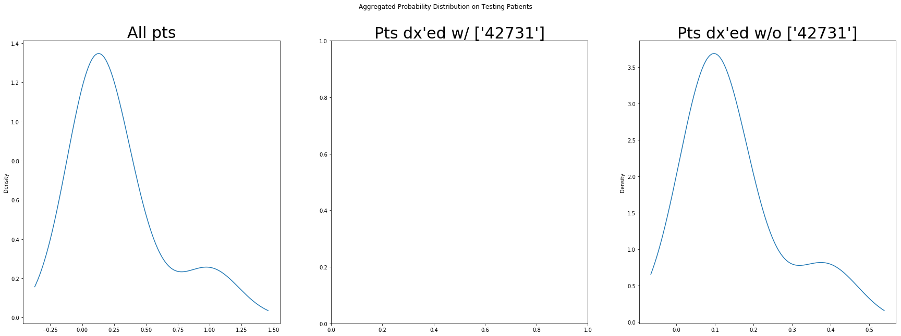

# Acute Organ Failure Intervention Model

To execute,

1. Install Apache Spark from https://spark.apache.org/downloads.html
2. Download MIMIC-3 demo dataset from https://physionet.org/content/mimiciii-demo/1.4/
3. Extract csv files under ./mimic-iii-clinical-database-demo-1.4
4. Run parquetizer.py with the following command:

`spark-submit parquetizer.py`

5. Run model trainer mimic_hp_training_scale.py with the following command:

`spark-submit mimic_hp_training_scale.py`


# Using mimic_post_hoc_analysis class for further analyses


```python

from mimic_post_hoc_analysis import mimic_post_hoc_analysis
cur_evaluator = mimic_post_hoc_analysis(is_debug=False, cur_signature="MIMIC3_DEMO"
                                            , target_disease=["42731"],hyperparam_selection="TVT")
import logging
cur_evaluator.logger.setLevel(logging.WARN)

cur_evaluator.set_top_intv_k(cur_top_k=5)

```

    [2019-11-06 17:47:10,064data_abstracter.py:56 -             __init__() ] HOME_DIR:./output/MIMIC3_DEMO/
    [2019-11-06 17:47:10,066data_abstracter.py:57 -             __init__() ] DATA_DIR:./mimic3_demo_dataset/
    [2019-11-06 17:47:10,067data_abstracter.py:58 -             __init__() ] INTERMEDIATE_DIR:./output/MIMIC3_DEMO//temp/
    [2019-11-06 17:47:24,631mimic_hp_training_scale.py:45 -             __init__() ] preprocessor_init done
    [2019-11-06 17:47:24,632mimic_hp_training_scale.py:55 -             __init__() ] run_experiment done
    [2019-11-06 17:47:25,398mimic_hp_training_scale.py:58 -             __init__() ] PREPROCESSOR_OUT
    

# Lab tests showed positive correlation with instance-level predictions
### Tests were measured during the prediction time window


```python

from IPython.display import display, HTML
cur_pandas = cur_evaluator.corr_predicted_risks()
for target_df in cur_pandas:
    display(HTML(target_df.to_html()))

```


<table border="1" class="dataframe">
  <thead>
    <tr style="text-align: right;">
      <th></th>
      <th>ITEMID</th>
      <th>Pearson_Correlation</th>
      <th>Num_OBS</th>
      <th>LABEL</th>
      <th>SOURCE</th>
    </tr>
  </thead>
  <tbody>
    <tr>
      <th>0</th>
      <td>50910</td>
      <td>0.924712</td>
      <td>5</td>
      <td>Creatine Kinase (CK)</td>
      <td>LAB</td>
    </tr>
    <tr>
      <th>1</th>
      <td>50911</td>
      <td>0.900046</td>
      <td>6</td>
      <td>Creatine Kinase, MB Isoenzyme</td>
      <td>LAB</td>
    </tr>
    <tr>
      <th>2</th>
      <td>50868</td>
      <td>0.688535</td>
      <td>31</td>
      <td>Anion Gap</td>
      <td>LAB</td>
    </tr>
    <tr>
      <th>3</th>
      <td>50863</td>
      <td>0.656966</td>
      <td>4</td>
      <td>Alkaline Phosphatase</td>
      <td>LAB</td>
    </tr>
    <tr>
      <th>4</th>
      <td>50818</td>
      <td>0.641187</td>
      <td>22</td>
      <td>pCO2</td>
      <td>LAB</td>
    </tr>
    <tr>
      <th>5</th>
      <td>50804</td>
      <td>0.592602</td>
      <td>22</td>
      <td>Calculated Total CO2</td>
      <td>LAB</td>
    </tr>
    <tr>
      <th>6</th>
      <td>50970</td>
      <td>0.538423</td>
      <td>32</td>
      <td>Phosphate</td>
      <td>LAB</td>
    </tr>
    <tr>
      <th>7</th>
      <td>50912</td>
      <td>0.418523</td>
      <td>31</td>
      <td>Creatinine</td>
      <td>LAB</td>
    </tr>
    <tr>
      <th>8</th>
      <td>50802</td>
      <td>0.414258</td>
      <td>22</td>
      <td>Base Excess</td>
      <td>LAB</td>
    </tr>
    <tr>
      <th>9</th>
      <td>50885</td>
      <td>0.386482</td>
      <td>4</td>
      <td>Bilirubin, Total</td>
      <td>LAB</td>
    </tr>
  </tbody>
</table>


# Lab tests showed negative correlation with instance-level predictions
### Tests were measured during the prediction time window


```python
cur_pandas = cur_evaluator.corr_predicted_risks(ascending=True)
for target_df in cur_pandas:
    display(HTML(target_df.to_html()))


```


<table border="1" class="dataframe">
  <thead>
    <tr style="text-align: right;">
      <th></th>
      <th>ITEMID</th>
      <th>Pearson_Correlation</th>
      <th>Num_OBS</th>
      <th>LABEL</th>
      <th>SOURCE</th>
    </tr>
  </thead>
  <tbody>
    <tr>
      <th>0</th>
      <td>50867</td>
      <td>-1.000000</td>
      <td>2</td>
      <td>Amylase</td>
      <td>LAB</td>
    </tr>
    <tr>
      <th>1</th>
      <td>50817</td>
      <td>-0.812277</td>
      <td>4</td>
      <td>Oxygen Saturation</td>
      <td>LAB</td>
    </tr>
    <tr>
      <th>2</th>
      <td>50813</td>
      <td>-0.765521</td>
      <td>8</td>
      <td>Lactate</td>
      <td>LAB</td>
    </tr>
    <tr>
      <th>3</th>
      <td>50882</td>
      <td>-0.589331</td>
      <td>31</td>
      <td>Bicarbonate</td>
      <td>LAB</td>
    </tr>
    <tr>
      <th>4</th>
      <td>50983</td>
      <td>-0.582930</td>
      <td>32</td>
      <td>Sodium</td>
      <td>LAB</td>
    </tr>
    <tr>
      <th>5</th>
      <td>50821</td>
      <td>-0.516630</td>
      <td>22</td>
      <td>pO2</td>
      <td>LAB</td>
    </tr>
    <tr>
      <th>6</th>
      <td>50820</td>
      <td>-0.485831</td>
      <td>22</td>
      <td>pH</td>
      <td>LAB</td>
    </tr>
    <tr>
      <th>7</th>
      <td>51277</td>
      <td>-0.483770</td>
      <td>25</td>
      <td>RDW</td>
      <td>LAB</td>
    </tr>
    <tr>
      <th>8</th>
      <td>50878</td>
      <td>-0.461652</td>
      <td>4</td>
      <td>Asparate Aminotransferase (AST)</td>
      <td>LAB</td>
    </tr>
    <tr>
      <th>9</th>
      <td>50861</td>
      <td>-0.460276</td>
      <td>4</td>
      <td>Alanine Aminotransferase (ALT)</td>
      <td>LAB</td>
    </tr>
  </tbody>
</table>


# Patient-level probability density on the training set


```python
training_agg_prob, testing_agg_prob = cur_evaluator.evaluate_agg_prob()

import matplotlib.pyplot as plt 

%matplotlib inline

fig1 = plt.figure(figsize=(30,10))

ax11 = fig1.add_subplot(131)
ax12 = fig1.add_subplot(132)
ax13 = fig1.add_subplot(133)

from pyspark.sql.functions import col

training_agg_prob.select("agg_prob").toPandas().plot.kde(ax=ax11,legend=False)
training_agg_prob.where(col(cur_evaluator.target_disch_col) == 1)\
    .select("agg_prob").toPandas().plot.kde(ax=ax12,legend=False)
training_agg_prob.where(col(cur_evaluator.target_disch_col) == 0)\
    .select("agg_prob").toPandas().plot.kde(ax=ax13,legend=False)

fontdict={'fontsize': 30, 'fontweight': 'medium'}

fig1.suptitle("Aggregated Probability Distribution on Training Patients",fontdict = fontdict)
ax11.set_title("All pts".format(cur_evaluator.target_disch_icd9),fontdict = fontdict)
ax12.set_title("Pts dx'ed w/ {0}".format(cur_evaluator.target_disch_icd9),fontdict = fontdict)
ax13.set_title("Pts dx'ed w/o {0}".format(cur_evaluator.target_disch_icd9),fontdict = fontdict)


```


    Text(0.5,1,"Pts dx'ed w/o ['42731']")


# Patient-level probability density on the test set


```python

fig2 = plt.figure(figsize=(30,10))


from pyspark.sql.functions import col

ax21 = fig2.add_subplot(131)
testing_agg_prob.select("agg_prob").toPandas().plot.kde(ax=ax21,legend=False)

ax22 = fig2.add_subplot(132)
if testing_agg_prob.where(col(cur_evaluator.target_disch_col) == 1).count() > 1:
    testing_agg_prob.where(col(cur_evaluator.target_disch_col) == 1)\
        .select("agg_prob").toPandas().plot.kde(ax=ax22,legend=False)
else:
    print("TESTING PTS w/ Disease is less than two")

ax23 = fig2.add_subplot(133)
if testing_agg_prob.where(col(cur_evaluator.target_disch_col) == 0).count() > 1:
    testing_agg_prob.where(col(cur_evaluator.target_disch_col) == 0)\
        .select("agg_prob").toPandas().plot.kde(ax=ax23,legend=False)
else:
    print("TESTING PTS w/o Disease is less than one")

fontdict={'fontsize': 30, 'fontweight': 'medium'}

fig2.suptitle("Aggregated Probability Distribution on Testing Patients",fontdict=fontdict)
ax21.set_title("All pts".format(cur_evaluator.target_disch_icd9),fontdict=fontdict)
ax22.set_title("Pts dx'ed w/ {0}".format(cur_evaluator.target_disch_icd9),fontdict=fontdict)
ax23.set_title("Pts dx'ed w/o {0}".format(cur_evaluator.target_disch_icd9),fontdict=fontdict)

```

    TESTING PTS w/ Disease is less than two
    


    Text(0.5,1,"Pts dx'ed w/o ['42731']")





# Feature contribution from the selected model


```python

#3. Feature contribution from the model
from pyspark.ml import PipelineModel

from glob import glob
import os
potential_model_list = cur_evaluator.model_dir_template.format(cur_evaluator.target_disch_col,"*")
list_potential_models = glob(potential_model_list)
print("List of identified models:{0}".format(list_potential_models))
print("Using {0}".format(list_potential_models[0]))

cur_model = PipelineModel.load(list_potential_models[0]).stages[-1]

cur_feature_contribution = cur_evaluator.eval_feature_contribution(cur_model,top_k=10)
display(HTML(cur_feature_contribution.to_html()))

```

    List of identified models:['./output/MIMIC3_DEMO\\MIMIC3_DEMO_DISCH_42731_GB_TVT_0.7_p_val_top_5_INTV_TOP_AUPRC_5_0.125']
    Using ./output/MIMIC3_DEMO\MIMIC3_DEMO_DISCH_42731_GB_TVT_0.7_p_val_top_5_INTV_TOP_AUPRC_5_0.125
    

    C:\Users\mudjj\Anaconda3\lib\site-packages\pyspark\sql\session.py:340: UserWarning: inferring schema from dict is deprecated,please use pyspark.sql.Row instead
      warnings.warn("inferring schema from dict is deprecated,"
    


<table border="1" class="dataframe">
  <thead>
    <tr style="text-align: right;">
      <th></th>
      <th>IG</th>
      <th>ITEMID</th>
      <th>LABEL</th>
      <th>feature_type</th>
      <th>method_or_value</th>
    </tr>
  </thead>
  <tbody>
    <tr>
      <th>0</th>
      <td>0.314744</td>
      <td>223792</td>
      <td>Pain Management</td>
      <td>categorical</td>
      <td>PCA</td>
    </tr>
    <tr>
      <th>1</th>
      <td>0.176246</td>
      <td>223751</td>
      <td>Non-Invasive Blood Pressure Alarm - High</td>
      <td>numeric</td>
      <td>LT</td>
    </tr>
    <tr>
      <th>2</th>
      <td>0.154205</td>
      <td>220048</td>
      <td>Heart Rhythm</td>
      <td>categorical</td>
      <td>AF (Atrial Fibrillation)</td>
    </tr>
    <tr>
      <th>3</th>
      <td>0.066793</td>
      <td>N/A</td>
      <td>MARITAL_STATUS</td>
      <td>demographics</td>
      <td>DIVORCED</td>
    </tr>
    <tr>
      <th>4</th>
      <td>0.044728</td>
      <td>223751</td>
      <td>Non-Invasive Blood Pressure Alarm - High</td>
      <td>numeric</td>
      <td>TT</td>
    </tr>
    <tr>
      <th>5</th>
      <td>0.044625</td>
      <td>220181</td>
      <td>Non Invasive Blood Pressure mean</td>
      <td>numeric</td>
      <td>avg</td>
    </tr>
    <tr>
      <th>6</th>
      <td>0.027869</td>
      <td>224847</td>
      <td>Impaired Skin Drainage Amount #1</td>
      <td>categorical</td>
      <td>Small</td>
    </tr>
    <tr>
      <th>7</th>
      <td>0.021487</td>
      <td>224756</td>
      <td>Response</td>
      <td>categorical</td>
      <td>No Response</td>
    </tr>
    <tr>
      <th>8</th>
      <td>0.017592</td>
      <td>223991</td>
      <td>Cough Effort</td>
      <td>categorical</td>
      <td>None</td>
    </tr>
    <tr>
      <th>9</th>
      <td>0.014462</td>
      <td>225187</td>
      <td>Back Care</td>
      <td>categorical</td>
      <td>1</td>
    </tr>
  </tbody>
</table>


# Selected interventions for annotation


```python
intervention_used_to_annotate = cur_evaluator.spark.read.parquet(cur_evaluator
                                 .annot_intv_dir.format(cur_evaluator.target_disch_col,cur_evaluator.sel_top))

target_intervention = cur_evaluator.get_def_df().join(intervention_used_to_annotate,"ITEMID")\
    .select("LABEL","SOURCE","p_val").orderBy("p_val").toPandas()

display(HTML(target_intervention.to_html()))

```


<table border="1" class="dataframe">
  <thead>
    <tr style="text-align: right;">
      <th></th>
      <th>LABEL</th>
      <th>SOURCE</th>
      <th>p_val</th>
    </tr>
  </thead>
  <tbody>
    <tr>
      <th>0</th>
      <td>Labetalol</td>
      <td>MED</td>
      <td>0.188041</td>
    </tr>
    <tr>
      <th>1</th>
      <td>Amiodarone</td>
      <td>MED</td>
      <td>0.264210</td>
    </tr>
    <tr>
      <th>2</th>
      <td>Diltiazem</td>
      <td>MED</td>
      <td>0.264210</td>
    </tr>
    <tr>
      <th>3</th>
      <td>Ranitidine (Prophylaxis)</td>
      <td>MED</td>
      <td>0.264210</td>
    </tr>
    <tr>
      <th>4</th>
      <td>Fluoroscopy</td>
      <td>PROC</td>
      <td>0.264210</td>
    </tr>
  </tbody>
</table>

